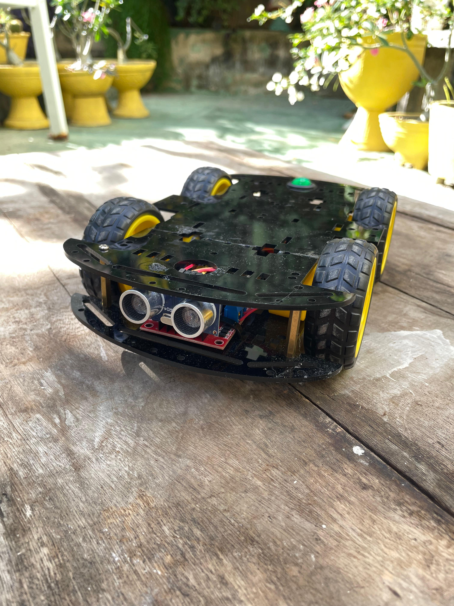
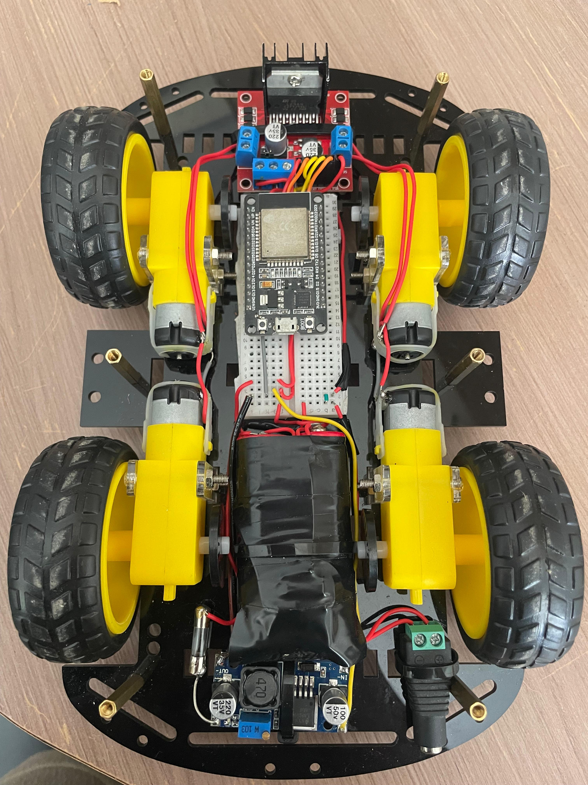
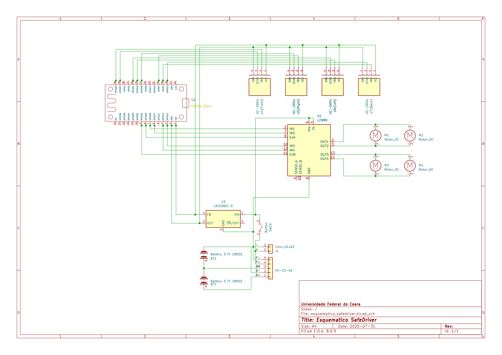
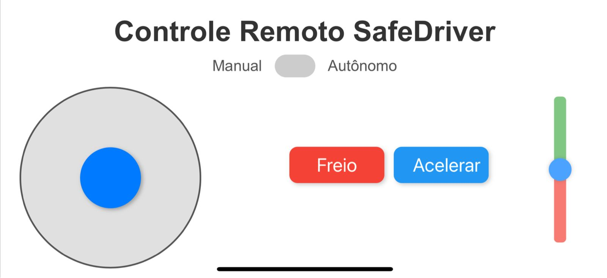

# SafeDriver 🚗

Carrinho robótico 4WD com controle embarcado via ESP32, sensores ultrassônicos e sistema de navegação manual e autônomo.

---

## 🔧 Sobre o Projeto

O **SafeDriver** é um protótipo de carrinho robótico desenvolvido como atividade prática da disciplina de Controle e Automação. O sistema combina controle de motores DC via ponte H com detecção de obstáculos por sensores ultrassônicos HC-SR04, tudo gerenciado por uma ESP32. O carrinho é capaz de operar de duas formas:

- **Modo Manual**: controlado por uma interface web hospedada na própria ESP32, com joystick e slider de velocidade.
- **Modo Autônomo**: movimenta-se evitando obstáculos com base nas leituras dos sensores posicionados nos quatro lados do chassi.

---

## ⚙️ Hardware Utilizado

- ESP32 DOIT DevKit v1
- Ponte H L298N (controle de dois pares de motores em série)
- 4 Motores DC 3–6 V (chassi 4WD)
- 4 sensores ultrassônicos HC-SR04 (frente, trás, esquerda, direita)
- Bateria 2S (2x 18650 com BMS 5A)
- Regulador LM2596 (conversão de 7.4 V para 5 V)
- Botão liga/desliga de 3 pinos
- Conector P4 para recarga
- Chassi robótico com suporte para motores

A ligação dos componentes foi projetada no KiCad, considerando controle PWM para velocidade e GPIOs para direção.

---

## 📷 Imagens do Projeto

### Resultado Final

    
    

### Visão Superior

### Esquemático Elétrico (KiCad)

### Interface Web (ESP32)

---

## 💻 Sobre o Código

O código foi desenvolvido em C++ utilizando o PlatformIO com a framework do Arduino para ESP32. Ele possui:

- **Inicialização de pinos, sensores e servidor web**
- **Controle dos motores com PWM**
- **Leitura sequencial dos sensores ultrassônicos**
- **Lógica de desvio de obstáculos no modo autônomo**
- **Servidor web que entrega uma página HTML com joystick, slider de velocidade e controle de modo**

A ESP32 processa comandos da interface via requisições HTTP e movimenta o carrinho de acordo com os dados recebidos (como direção, aceleração e modo de operação). A cada ciclo, o código também atualiza as leituras dos sensores para detectar obstáculos e tomar decisões automaticamente.

---

## 🧪 Testes

- Navegação autônoma com desvio de obstáculos próximos
- Controle manual fluido via interface web
- Estabilidade da comunicação Wi-Fi local
- Regulação de tensão eficaz com LM2596
- Capacidade de alimentação da bateria 2S durante uso contínuo

---

## 📌 Observações

Este projeto foi desenvolvido com fins acadêmicos e didáticos, integrando conceitos de controle de motores, sensoriamento, automação e sistemas embarcados. As imagens e o esquemático estão disponíveis na pasta `/images`.

---

